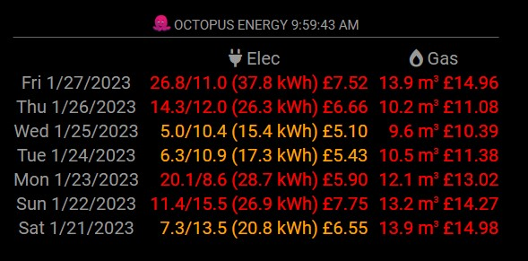

# MMM-IntelligentOctopus


## IMPORTANT

If you are already using MMM-IntelligentOctopus in your project you will need to make a change to your config.js file as the example below

## Description

"Intelligent Octopus Monitor", displays energy usage history for your Octopus Energy account. Unofficial!

Electricity usage is displayed in the format **'offPeakUsage/PeakUsage (totalUsage) Cost'**

This is being actively developed at the moment so please keep your copy updated

## Example



## Dependencies

* An installation of [MagicMirror<sup>2</sup>](https://github.com/MichMich/MagicMirror)
* An electricity and/or gas supply account with Octopus Energy and a smart electricity meter

## Installation

1. Clone this repo into `~/MagicMirror/modules` directory, to create `~/MagicMirror/modules/MMM-IntelligentOctopus`.

```
	cd ~/MagicMirror/modules
	git clone https://github.com/ianmccon/MMM-IntelligentOctopus
```

1. Add IntelligentOctopus configuration into `~/MagicMirror/config/config.js`:

```
	{
		module: 'MMM-IntelligentOctopus',
		position: 'bottom_right',
		header: ' Octopus Energy',
		config: {
				api_key: '[YOUR-API-KEY]',
				elec_mpan: '[ELECTRIC-MPAN]',
				elec_serial: '[ELEC-SERIAL]',
				gas_mprn: '[GAS-MPRN]',
				elec_serial: '[GAS-SERIAL]',
				displayDays: 7,
				elecMedium: 10,
				elecHigh: 20,
 				elecCostKWHFixed: 0.35,
				elecCostKWHPeak: 0.3572,
				elecCostKWHoffPeak: 0.1372,
				elecPeakStartTime: '05:30',
				elecPeakEndTime: '23:30',
				elecCostSC: 0.25,
				gasMedium: 5,
				gasHigh: 6,
				gasCostKWH: 0.0331,
				gasCostSC: 0.168,
				gasMeterSMETSType: 2,				
				decimalPlaces: 1,
				showUpdateTime: true,
				updateInterval: 60000*60,
				retryDelay: 5000,
				animationSpeed: 2000,
		}
	},
```

1. Obtain your API key from the Octopus Energy website, by signing into your account, then click 'Menu' -> 'My Account' -> 'Personal Details' -> 'API Access'. This page will also provide you with the electricity meter's MPAN and Serial numbers, and the gas meter's MPRN and Serial numbers, which need to be replaced above.

## Configuration options

The following config.js properties can be configured.

| **Option** | **Default** | **Description** |
| --- | --- | --- |
| 'header' | 'octobw.jpg' | other graphics available in the 'public' directory, or just remove it |
| 'displayDays' | '7' | The number of days of historical energy usage to display |
| 'elecMedium' | '10' | kWh values over this amount will be displayed in Orange |
| 'elecHigh' | '20' | kWh values over this amount will be displayed in Red |
| 'elecCostKWHPeak' | '0.3572' | peak cost per kwh in pounds, or zero to hide display |
| 'elecCostKWHoffPeak' | '0.1372' | off peak cost per kwh in pounds, or zero to hide display |
| 'elecPeakStartTime' | '05:30' | peak start time |
| 'elecPeakEndTime' | '23:30' | peak end time |s
| 'elecCostSC' | '0.25' | daily standing charge in pounds |
| 'gasMedium' | '5' | kWh values over this amount will be displayed in Orange |
| 'gasHigh' | '6' | kWh values over this amount will be displayed in Red |
| 'gasCostKWH' | '0.0331' | cost per kWh in pounds, or zero to hide display |
| 'gasCostSC' | '0.168' | daily standing charge in pounds |
| 'gasMeterSMETSType' | '2' | SMETS 1 meters give readings in kwh and SMETS 2 meters give them in m<sup>3</sup> |
| 'decimalPlaces' | '1' | round all kWh values to this number of decimal places |
| 'showUpdateTime' | 'true' | true or false, to display the time the energy usage figures were last updated |
| 'updateInterval' | '60000\*60' | delay between refresing energy usage via the API, in milliseconds (1 hour, or 60 * 60 seconds) |
| 'retryDelay' | '5000' | delay between failing to get a valid result from the API and trying again in milliseconds (5 seconds) |
| 'animationSpeed' | '2000' | fade in/out speed in milliseconds (2 seconds) |


## Disclaimer

This module has been built on top of MMM-Octomon, written by Chris Thomas. This is only for you if you are on the Intelligent Octopus tariff. If you are on a fixed rate tariff you should use [MMM-Octomon](https://github.com/christopherpthomas/MMM-OctoMon). 

I welcome any suggestions for improvements. Supplied AS-IS. No warranties expressed or implied. 
